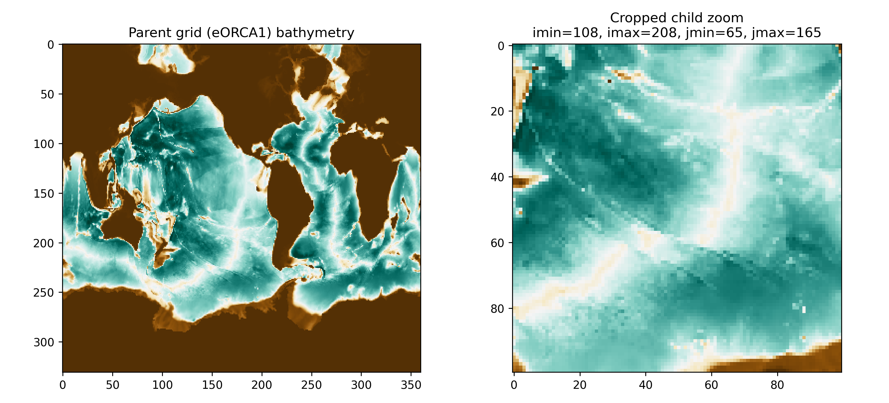

# DOMAINcfg user guide

`DOMAINcfg` is a standalone NEMO tool (`tools/DOMAINcfg`) that produces
`domain_cfg.nc` — the mesh/bathymetry file NEMO reads at startup, containing
grid coordinates, cell thicknesses, the land/sea mask, and `bottom_level`.
It can either compute this file from scratch (bathymetry + analytic
vertical-coordinate formula) or, for an AGRIF nested configuration, read an
already-built parent `domain_cfg.nc` and derive a matching child
`N_domain_cfg.nc` from it, so that cell volumes agree at the nest interface
(`N` is the AGRIF nest number, e.g. `1_domain_cfg.nc`).

## Building the tool

To be able to produce AGRIF child grids, the tool must be compiled with
`key_agrif` — without it, it can only build a (parent) `domain_cfg.nc` with
no nesting support:

```shell
cd tools
echo "bld::tool::fppkeys key_mpp_mpi key_agrif" > DOMAINcfg/cpp_DOMAINcfg.fcm
./maketools -n DOMAINcfg -m auto
```

This uses the same architecture file as the main NEMO build. The build
produces `make_domain_cfg.exe` and a helper script, `make_namelist.py`.

## Setting up a build directory

Each parent configuration you build domains for needs its own build
directory under `tools/DOMAINcfg/cfgs/`:

```shell
mkdir -p cfgs/<config_name> && cd cfgs/<config_name>
ln -sf ../../make_domain_cfg.exe .
ln -sf ../../make_namelist.py . && chmod +x make_namelist.py

# one namelist_ref symlink and one namelist_cfg copy per grid: unprefixed
# for the parent, N_-prefixed for each child nest number declared in
# AGRIF_FixedGrids.in (here, a single child nest, number 1)
ln -sf ../../namelist_ref .
cp ../../namelist_cfg .
for N in 1; do
  ln -sf ../../namelist_ref ${N}_namelist_ref
  cp ../../namelist_cfg ${N}_namelist_cfg
done
```

`namelist_ref` is the same reference namelist for every grid, so it's
always a symlink. `namelist_cfg`, in contrast, needs real per-grid content
(different resolution, different mesh) — copying it here just guarantees a
file exists for every grid before the tool needs it; the parent's copy is
edited by hand (§2), and each child's copy is overwritten automatically
later, once `AGRIF_FixedGrids.in` exists (§5).

The directory needs the following inputs before running the tool, in this
order.

### 1. `AGRIF_FixedGrids.in`: the nest hierarchy definition

`AGRIF_FixedGrids.in` is the file that tells both `DOMAINcfg` and NEMO
itself where each AGRIF child grid sits inside its parent, and how much
finer its resolution is. It is required even for a parent-only build (in
that case, its first line is `0`, meaning no child grids), and it is read
by `DOMAINcfg` to know what child `N_domain_cfg.nc` file(s) to produce, and
by NEMO at runtime to know what child grid(s) to instantiate.

Each line after the first describes one child grid as
`imin imax jmin jmax rho_x rho_y rho_t`:
- `imin/imax/jmin/jmax` are the parent-grid index bounds of the zoom (in
  the parent's own `i`/`j` index space, not geographic coordinates).
- `rho_x/rho_y/rho_t` are the horizontal (x, y) and time refinement
  factors — how many child cells/timesteps fit inside one parent
  cell/timestep. They need not be equal to one another. The child's
  timestep is fixed at `rn_Dt_parent / rho_t`, so `rho_t` must divide
  evenly into the parent's timestep — it is not independently choosable.

The first line gives the number of child grids, and a trailing `0`
terminates the list. Nested (grandchild) grids are expressed by repeating
this same block, indented under their parent's entry, with their own
trailing `0`.

Because `imin/imax/jmin/jmax` are index bounds, not coordinates, it's easy
to pick a box that doesn't actually sit where you think it does — always
check the zoom visually against the parent bathymetry before building
anything from it. The following script does that: it opens the parent
`domain_cfg.nc`, crops it to the proposed `imin/imax/jmin/jmax` box, and
plots the full parent grid alongside the cropped region so the two can be
compared by eye.

```python
#!/usr/bin/env python3
import os
import numpy as np
import matplotlib.pyplot as plt
import netCDF4 as netcdf
#
# Open domain_cfg.nc eOrca1 (original grid) - Root_dir is the same exported
# variable set at the top of this document
Root_dir = os.environ["Root_dir"]
eOrca100_gridfile = f"{Root_dir}/nemo-5.0.1/tools/DOMAINcfg/cfgs/Pacific/domain_cfg.nc"
eOrca100_grid = netcdf.Dataset(eOrca100_gridfile, "r", format="NETCDF4")

# imin/imax/jmin/jmax must match the zoom defined in AGRIF_FixedGrids.in
imin = 108
imax = 208
jmin = 65
jmax = 165

# Read bathymetry for a visual check
eOrca100_bathy = eOrca100_grid.variables["bathy_metry"][0]
cropped = eOrca100_bathy[jmin:jmax,imin:imax]
# Visual check
plt.rcParams['figure.dpi'] = 250
fig, axes = plt.subplots(1, 2, figsize=(11, 5))
axes[0].imshow(eOrca100_bathy[::-1,:], cmap="BrBG", interpolation=None)
axes[0].set_title("Parent grid (eORCA1) bathymetry")
axes[1].imshow(cropped[::-1,:], cmap="BrBG", interpolation=None)
axes[1].set_title(f"Cropped child zoom\nimin={imin}, imax={imax}, jmin={jmin}, jmax={jmax}")
plt.tight_layout()
plt.show()
```

Running it on the parent grid and a proposed zoom produces the two panels
below, side by side — the full parent bathymetry, and the same region
cropped to `imin/imax/jmin/jmax`:



Once the box looks right, write it into `AGRIF_FixedGrids.in` — for example,
a single child zoom with `imin imax jmin jmax rho_x rho_y rho_t` =
`108 208 65 165 3 3 3`:
```
1
108 208 65 165 3 3 3
0
```

### 2. `namelist_cfg`: the specifics of the parent grid

`namelist_cfg` describes the *parent* grid: its resolution, its vertical
levels, its coordinate type, and where its bathymetry comes from. It does
**not** describe the child zoom in any way — that comes entirely from
`AGRIF_FixedGrids.in` (§1) — so the same `namelist_cfg` is reusable
unchanged for every zoom cut from the same parent configuration. It only
needs editing when the parent configuration itself changes (different
resolution, different number of vertical levels, a different bathymetry
source, and so on).

The file is structured as a small number of Fortran namelist blocks
(`&block_name ... /`), each grouping one aspect of the domain. `DOMAINcfg`
only reads three of them:

- **`&namdom`** — the space/time domain: where the bathymetry comes from,
  the external topography file, and the vertical-coordinate coefficients.
- **`&namcfg`** — the configuration's identity and dimensions: grid name,
  parent grid size (`jpidta`/`jpjdta`/`jpkdta`), and the lateral boundary
  condition type.
- **`&namzgr`** — the vertical coordinate family (z-full-step, z-partial-step,
  s-coordinate, or ice-shelf cavities).

```fortran
!-----------------------------------------------------------------------
&namdom        !   space and time domain (bathymetry, mesh, timestep)
!-----------------------------------------------------------------------
   ln_read_cfg = .true.
   nn_bathy    =    1      ! = 0 compute analyticaly
                           ! = 1 read the bathymetry file
                           ! = 2 compute from external bathymetry
                           ! = 3 compute from parent (if "key_agrif")
   nn_interp   =    1              ! type of interpolation (nn_bathy =2)
   cn_domcfg   =  'domain_cfg.nc'  ! external grid file
   cn_topo     =  'GEBCO_2020.nc'  ! external topo file (nn_bathy =2)
   cn_bath     =  'elevation'      ! topo name in file  (nn_bathy =2)
   cn_lon      =  'lon'            ! lon  name in file  (nn_bathy =2)
   cn_lat      =  'lat'            ! lat  name in file  (nn_bathy =2)
   rn_scale    = 1
   rn_bathy    =    0.     !  value of the bathymetry. if (=0) bottom flat at jpkm1
   jphgr_msh   =       0               !  type of horizontal mesh
   ppglam0     =  999999.0             !  longitude of first raw and column T-point (jphgr_msh = 1)
   ppgphi0     =  999999.0             ! latitude  of first raw and column T-point (jphgr_msh = 1)
   ppe1_deg    =  999999.0             !  zonal      grid-spacing (degrees)
   ppe2_deg    =  999999.0             !  meridional grid-spacing (degrees)
   ppe1_m      =  999999.0             !  zonal      grid-spacing (degrees)
   ppe2_m      =  999999.0             !  meridional grid-spacing (degrees)
   ppsur       =   -3958.951371276829  !  ORCA r4, r2 and r05 coefficients
   ppa0        =     103.9530096000000 ! (default coefficients)
   ppa1        =       2.415951269000000   !
   ppkth       =      15.35101370000000    !
   ppacr       =       7.0             !
   ppdzmin     =  999999.0             !  Minimum vertical spacing
   pphmax      =  999999.0             !  Maximum depth
   ldbletanh   =   .TRUE.              !  Use/do not use double tanf function for vertical coordinates
   ppa2        =     100.7609285000000 !  Double tanh function parameters
   ppkth2      =      48.02989372000000    !
   ppacr2      =      13.00000000000   !
/
&namcfg
   ln_e3_dep   = .true.            ! e3 = dk[depth] in the discrete sense (the only supported mode)
   ln_dept_mid = .true.            ! T points at cell mid-depth
   cp_cfg      =  "orca"
   jp_cfg      =       1
   jpidta      =     360           ! parent grid dimensions — must match cn_domcfg exactly
   jpjdta      =     331
   jpkdta      =      75
   Ni0glo      =     360
   Nj0glo      =     331
   jpkglo      =      75
   jperio      =       4           ! lateral condition type (0-6)
   ln_domclo   = .false.
/
!-----------------------------------------------------------------------
&namzgr        !   vertical coordinate                                  (default: NO selection)
!-----------------------------------------------------------------------
!-----------------------------------------------------------------------
   ln_zco      = .false.   !  z-coordinate - full    steps
   ln_zps      = .true.   !  z-coordinate - partial steps
   ln_sco      = .false.   !  s- or hybrid z-s-coordinate
   ln_isfcav   = .false.   !  ice shelf cavity             (T: see namzgr_isf)
/
```

#### Options in `&namdom`

- **`ln_read_cfg`** — the single most consequential switch in this file.
  When `.true.`, the horizontal and vertical mesh are read directly from
  `cn_domcfg`, and **`nn_bathy` is ignored entirely** for mesh generation.
  When `.false.` (its Fortran default), the mesh is computed from scratch
  according to `nn_bathy` and the coefficients below it. Always check its
  actual value in the namelist being used rather than assuming which mode a
  given build ran in.
- **`nn_bathy`** — selects how bathymetry is obtained, when `ln_read_cfg`
  doesn't already bypass it:

  | Value | Behavior |
  |---|---|
  | `0` | Compute bathymetry analytically. |
  | `1` | Read an already model-grid-interpolated bathymetry file. If `ln_read_cfg=.true.`, coordinates follow `cn_domcfg`; if `.false.`, they follow `ppglam0`/`ppgphi0`/`ppe1_deg`/`ppe2_deg` below. For a child build in this mode, the file must already match the exact domain size and position given in `AGRIF_FixedGrids.in` — there is no lat/lon lookup, the region is overlaid positionally. |
  | `2` | Read an external bathymetry file (`cn_topo`) and interpolate it onto the model grid. |
  | `3` | Derive bathymetry from the parent's, over the region defined in `AGRIF_FixedGrids.in`, with no external file and no interpolation — the parent bathymetry is simply reshaped onto more grid points (requires `key_agrif`). |
- **`nn_interp`** — interpolation method used when `nn_bathy=2`.
- **`cn_domcfg`** — name of the grid file that is both read (if
  `ln_read_cfg=.true.`) and written (always) by the tool.
- **`cn_topo`**, **`cn_bath`**, **`cn_lon`**, **`cn_lat`** — the external
  topography file and the names of its bathymetry/longitude/latitude
  variables. `cn_topo` is opened unconditionally at startup, regardless of
  `nn_bathy` or `ln_read_cfg` — it must exist even in builds where its
  contents are never actually used.
- **`rn_scale`**, **`rn_bathy`** — a bathymetry scale factor, and a flat
  bottom depth used when `rn_bathy` is nonzero (bottom flat at level
  `jpkm1` when `rn_bathy=0`).
- **`jphgr_msh`** and the `pp*` grid-origin/spacing parameters — define the
  horizontal mesh analytically when `jphgr_msh=1`; unused when the mesh
  comes from `cn_domcfg` or from GEBCO-style external bathymetry.
- **`ppsur`/`ppa0`/`ppa1`/`ppkth`/`ppacr`/`ppdzmin`/`pphmax`/`ldbletanh`/
  `ppa2`/`ppkth2`/`ppacr2`** — the analytic vertical-coordinate coefficients.
  These are not free parameters to tune by hand; pick the entry matching
  the target vertical grid from
  `tools/DOMAINcfg/README_configs_namcfg_namdom`,
  which ships with the NEMO source tree and lists worked example coefficient
  sets for a number of standard configurations — the values shown above
  (`ppsur=-3958.951371276829`, `ppa0=103.9530096`, ...) are that file's
  entry for a 75-level ORCA1 vertical grid, picked as the example running
  through this document.

#### Options in `&namcfg`

- **`ln_e3_dep`**, **`ln_dept_mid`** — discretization choices for cell
  thickness and the vertical placement of T-points; left at their standard
  values (`.true.`/`.true.`) for any current NEMO configuration.
- **`cp_cfg`**, **`jp_cfg`** — the configuration's name and resolution tag,
  free-form identifiers used elsewhere for file naming, not physically
  meaningful on their own.
- **`jpidta`/`jpjdta`/`jpkdta`** — the parent grid's full dimensions
  (i, j, k). Must match `cn_domcfg`'s actual dimensions exactly, or reading
  it fails.
- **`Ni0glo`/`Nj0glo`** — the global domain size, normally equal to
  `jpidta`/`jpjdta`.
- **`jpkglo`** — the global number of vertical levels, normally equal to
  `jpkdta`.

  The values shown above for `jpidta` through `jpkglo` (`360`, `331`, `75`)
  are not generic defaults — they were chosen to match the actual
  `domain_cfg.nc` of the eOrca1 configuration used as the running example
  in this document. For a different parent grid, these must be set to that
  grid's own dimensions instead.
- **`jperio`** — the lateral boundary condition type (0–6: none, periodic,
  symmetric, north-fold variants, and so on) — must match the parent's
  actual grid topology.
- **`ln_domclo`** — whether closed-sea masks are computed (see `&namclo`
  if enabled).

#### Options in `&namzgr`

- **`ln_zco`/`ln_zps`/`ln_sco`/`ln_isfcav`** — mutually exclusive selectors
  for the vertical coordinate family: full z-levels, partial z-levels
  (the common choice for ORCA-family configurations), s-coordinates, or
  ice-shelf cavities. Must match the coordinate type the parent mesh was
  actually built with — mixing this up produces a mesh that is internally
  inconsistent even though every individual field still reads back fine.

### 3. The external topography file

Named by `cn_topo` in `namelist_cfg` (e.g. a GEBCO bathymetry file) — the
tool opens this file unconditionally at startup regardless of which
bathymetry mode is actually selected, so it must exist in the build
directory even when its contents end up unused. Without it, `DOMAINcfg`
crashes immediately on startup, whether or not the selected `nn_bathy`/
`ln_read_cfg` combination actually reads bathymetry from it.

### 4. `domain_cfg.nc`: the parent domain to be modified

Named by `cn_domcfg`, only actually read if `ln_read_cfg=.true.`. This is
the parent grid's mesh/bathymetry, provided here as an input purely so the
tool can derive a matching child grid from it — but it is not left alone in
the process: running the tool also recomputes and overwrites this same
file in place (§6), so treat whatever gets copied in here as something
about to be modified, not a read-only reference. Copy it in — **never
symlink it**:
```shell
cp /path/to/domain_cfg.nc .
cp domain_cfg.nc domain_cfg_original.nc   # keep an unmodified copy to compare against later
```
> [!WARNING]
> `make_domain_cfg.exe` writes its output to a file named `domain_cfg.nc`
> in this same directory. If that name is a symlink to the canonical
> source file elsewhere, running the tool overwrites that file in place.

### 5. Per-child namelists

Regenerated from the parent `namelist_cfg`:
```shell
./make_namelist.py
```
This reads `AGRIF_FixedGrids.in` and rewrites `N_namelist_cfg` for every
child grid, with `Ni0glo`/`Nj0glo`/`jperio` etc. recomputed for that
child's actual size and position — overwriting the generic copy placed
during setup (§"Setting up a build directory") with the real, child-sized
values. `N_namelist_ref` needs no further action here: it was already
symlinked for every nest number up front, and `make_namelist.py` doesn't
touch it.

### 6. Running the tool

```shell
./make_domain_cfg.exe
```
This produces `N_domain_cfg.nc` for every child grid defined in
`AGRIF_FixedGrids.in`, and also (re)writes `domain_cfg.nc` for the parent —
recomputed as a side effect, overwriting the copy placed in step 4.

## Checking the regenerated parent file

Even where a cell was already wet in both, `bottom_level` can shift by ±1
during the recompute — and in principle any other field written to
`domain_cfg.nc` could differ too, not just the mask. The following script
checks the full file rather than just `bottom_level`: it compares the
variable inventory, the land/sea masks and vertical index fields, the
bathymetry, the horizontal mesh (coordinates, scale factors, Coriolis
parameter — these are expected to be identical when `ln_read_cfg=.true.`,
so any nonzero diff there is itself a finding), the vertical scale
factors, the scalar configuration flags (`jperio`, `jpiglo`, `jpjglo`,
`jpkglo`, the coordinate-type flags), and finally scans the new file for
any `NaN`/`Inf` values:

```python
#!/usr/bin/env python3
"""Exhaustive diff between an original and a regenerated domain_cfg.nc."""
import sys
import numpy as np
from netCDF4 import Dataset

OLD_FILE = "domain_cfg_original.nc"
NEW_FILE = "domain_cfg.nc"

MASK_VARS  = ["bottom_level", "top_level", "mbku", "mbkv", "mbkf"]
BATHY_VARS = ["bathy_metry", "isf_draft"]
COORD_VARS = ["glamt", "glamu", "glamv", "glamf", "gphit", "gphiu", "gphiv", "gphif"]
HGRID_VARS = ["e1t", "e1u", "e1v", "e1f", "e2t", "e2u", "e2v", "e2f", "ff_t", "ff_f"]
VGRID_3D   = ["e3t_0", "e3u_0", "e3v_0", "e3f_0", "e3w_0", "e3uw_0", "e3vw_0"]
VGRID_1D   = ["e3t_1d", "e3w_1d"]
SCALARS    = ["jperio", "jpiglo", "jpjglo", "jpkglo", "ln_isfcav", "ln_sco", "ln_zco", "ln_zps"]


def load(path, name):
    d = Dataset(path)
    if name not in d.variables:
        return None
    return np.squeeze(d.variables[name][:])


def report_stats(label, old, new):
    if old.shape != new.shape:
        print(f"  {label:14s} SHAPE MISMATCH: old={old.shape} new={new.shape} — skipped")
        return
    diff = np.asarray(new, dtype=float) - np.asarray(old, dtype=float)
    nonzero = diff[diff != 0]
    print(f"  {label:14s} differing cells: {nonzero.size:8d} / {diff.size:8d}"
          f"   max|diff|={np.abs(diff).max():.6g}   mean|diff (where !=0)|="
          f"{(np.abs(nonzero).mean() if nonzero.size else 0):.6g}")


def check_variable_lists(old_path, new_path):
    old_vars = set(Dataset(old_path).variables.keys())
    new_vars = set(Dataset(new_path).variables.keys())
    only_old = old_vars - new_vars
    only_new = new_vars - old_vars
    print("== Variable inventory ==")
    if only_old:
        print(f"  only in original : {sorted(only_old)}")
    if only_new:
        print(f"  only in new file : {sorted(only_new)}")
    if not only_old and not only_new:
        print("  identical variable sets")
    print()


def check_masks(old_path, new_path):
    print("== Land/sea masks and vertical index fields ==")
    for name in MASK_VARS:
        old, new = load(old_path, name), load(new_path, name)
        if old is None or new is None:
            continue
        if old.shape != new.shape:
            print(f"  {name:14s} SHAPE MISMATCH: old={old.shape} new={new.shape} — skipped")
            continue
        diff_cells = (old != new).sum()
        if name in ("bottom_level", "top_level"):
            land_to_sea = ((old == 0) & (new != 0)).sum()
            sea_to_land = ((old != 0) & (new == 0)).sum()
            shifted     = ((old != new) & (old != 0) & (new != 0)).sum()
            print(f"  {name:14s} differing cells: {diff_cells:6d}  "
                  f"(land→sea: {land_to_sea}, sea→land: {sea_to_land}, "
                  f"depth-shifted: {shifted})")
        else:
            print(f"  {name:14s} differing cells: {diff_cells:6d}")
    print()


def check_bathymetry(old_path, new_path):
    print("== Bathymetry / ice-shelf draft ==")
    for name in BATHY_VARS:
        old, new = load(old_path, name), load(new_path, name)
        if old is None or new is None:
            continue
        report_stats(name, old, new)
    print()


def check_horizontal_mesh(old_path, new_path):
    print("== Horizontal mesh (coordinates, scale factors, Coriolis) ==")
    print("  expected to be identical — any nonzero diff here means the")
    print("  horizontal grid itself changed, not just the mask/bathymetry")
    for name in COORD_VARS + HGRID_VARS:
        old, new = load(old_path, name), load(new_path, name)
        if old is None or new is None:
            continue
        report_stats(name, old, new)
    print()


def check_vertical_scale_factors(old_path, new_path):
    print("== Vertical scale factors (e3*) ==")
    for name in VGRID_1D + VGRID_3D:
        old, new = load(old_path, name), load(new_path, name)
        if old is None or new is None:
            continue
        report_stats(name, old, new)
    print()


def check_scalars(old_path, new_path):
    print("== Scalar configuration flags ==")
    old_d, new_d = Dataset(old_path), Dataset(new_path)
    for name in SCALARS:
        if name not in old_d.variables or name not in new_d.variables:
            continue
        ov = np.asarray(old_d.variables[name][:]).item()
        nv = np.asarray(new_d.variables[name][:]).item()
        flag = "  <-- CHANGED" if ov != nv else ""
        print(f"  {name:10s} old={ov!r:>8}  new={nv!r:>8}{flag}")
    print()


def check_nans(new_path):
    print("== NaN / Inf check on the new file ==")
    d = Dataset(new_path)
    bad = []
    for name, var in d.variables.items():
        if not np.issubdtype(var.dtype, np.floating):
            continue
        data = np.asarray(var[:])
        n_nan = np.isnan(data).sum()
        n_inf = np.isinf(data).sum()
        if n_nan or n_inf:
            bad.append((name, n_nan, n_inf))
    if bad:
        for name, n_nan, n_inf in bad:
            print(f"  {name:14s} NaN={n_nan}  Inf={n_inf}")
    else:
        print("  none found")
    print()


if __name__ == "__main__":
    old_path = sys.argv[1] if len(sys.argv) > 1 else OLD_FILE
    new_path = sys.argv[2] if len(sys.argv) > 2 else NEW_FILE

    check_variable_lists(old_path, new_path)
    check_masks(old_path, new_path)
    check_bathymetry(old_path, new_path)
    check_horizontal_mesh(old_path, new_path)
    check_vertical_scale_factors(old_path, new_path)
    check_scalars(old_path, new_path)
    check_nans(new_path)
```

A nonzero `bottom_level`/`top_level` diff alone is routine (see below). A
nonzero diff in the horizontal-mesh section, or a changed `jperio`/
`jpiglo`/`jpjglo`, is not — it means the regenerated file describes a
different grid, not just a different mask, and is worth understanding
before it replaces anything currently in use.

If cells that used to be land are now marked wet, any restart written for
the old mesh will have no real data at those newly-wet levels — NEMO will
read whatever raw fill value is stored there (typically `0.0`) as real
tracer state, which can cause an immediate blow-up at the first timestep.
If the regenerated parent file differs from the original, the restart
needs to be extended onto the new bathymetry (e.g. by constant vertical
extrapolation of the deepest previously-valid level, and by copying the
nearest wet neighbor's profile for any column that was fully land before)
before it can be reused, rather than reverting the domain file.

## Common failure modes

### Wrong-size or wrong-position child grid

If a build directory was bootstrapped from another configuration's files, a
leftover `AGRIF_FixedGrids.in` from that other configuration silently
produces a child domain of the wrong size and position. Always verify the
contents of this file immediately before running the tool.

### Tool fails to start because `cn_topo` is missing

This happens even in builds where bathymetry is not actually being
computed from it (`ln_read_cfg=.true.`), because the file is opened
unconditionally. Make sure a file with that exact name exists in the build
directory.

### Original bathymetry file gets corrupted

This happens if `domain_cfg.nc` is placed in the build directory as a
symlink rather than a copy — the tool's own output overwrites it in place.
Always copy.

### `iom_get_123d`-style "start and count too big" error when reading `cn_domcfg`

This means the mesh file actually being read is smaller than what the
namelist/`AGRIF_FixedGrids.in` expect. Since `ln_read_cfg=.true.` silently
overrides `nn_bathy`, check `cn_domcfg`'s actual value and the file's
actual dimensions (e.g. via `ncdump -h`) before assuming the flag itself is
misconfigured.

### Tool fails to open a per-child namelist

`make_namelist.py` only writes `N_namelist_cfg` files, never
`N_namelist_ref` — that symlink must be created manually for every nest
number, or the tool will fail trying to open it.

## After `domain_cfg.nc` / `N_domain_cfg.nc` exist

Producing the domain file is necessary but not sufficient for a runnable
configuration.

### Interpolation weight files

On-the-fly interpolation weight files, dimensioned to match each grid's
`domain_cfg.nc`, are still needed for every field read via horizontal
interpolation (produced with NEMO's `WEIGHTS` tool).

### Child restart files

If a child grid runs with its own persistent restart, a restart file
interpolated (or otherwise produced) to match that child's grid and mesh is
still needed — a plain copy of the parent's restart is not valid, since the
grids are generally not a simple index subset of one another.
